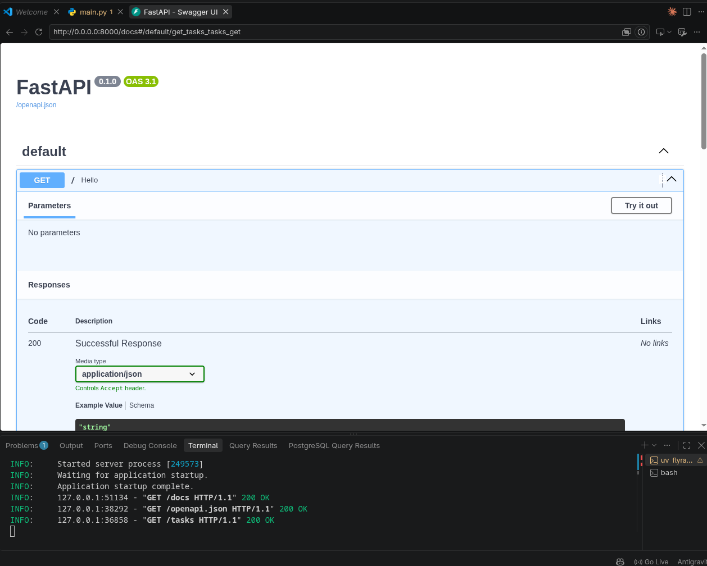
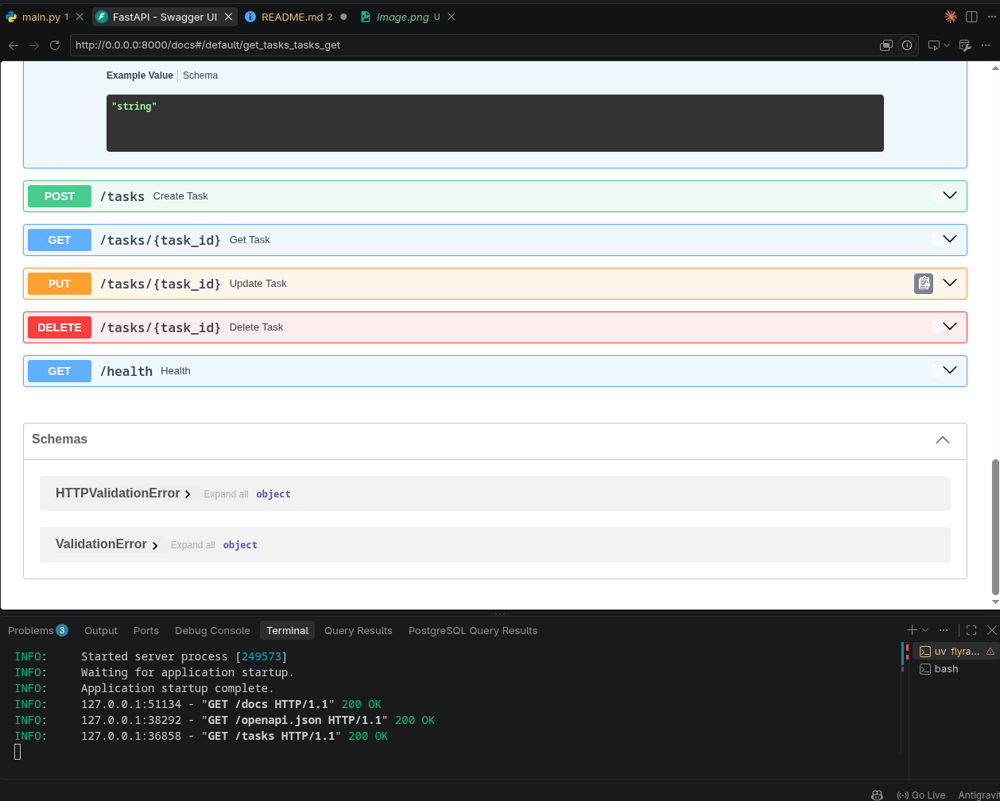

# FlyRank CRUD API

A small task-management API built with [FastAPI](https://fastapi.tiangolo.com/). Data is stored in memory, so it resets whenever the application restarts.

## Requirements

- Python 3.14 or newer
- [uv](https://docs.astral.sh/uv/)

## Setup

Install the project dependencies:

```bash
uv sync
```

Start the development server:

```bash
uv run uvicorn flyrank_crud_api.main:app --reload
```

The API is available at <http://localhost:8000>. Interactive API documentation is available at <http://localhost:8000/docs>.

## Endpoints

| Method | Path | Description |
| --- | --- | --- |
| `GET` | `/` | Return API information |
| `GET` | `/health` | Check API health |
| `GET` | `/tasks` | List all tasks |
| `GET` | `/tasks/{task_id}` | Get one task |
| `POST` | `/tasks` | Create a task |
| `PUT` | `/tasks/{task_id}` | Update a task |
| `DELETE` | `/tasks/{task_id}` | Delete a task |

## Examples

List tasks:

```bash
curl http://localhost:8000/tasks
```

Create a task:

```bash
curl -X POST http://localhost:8000/tasks \
	-H "Content-Type: application/json" \
	-d '{"title":"Buy milk"}'
```

Update a task:

```bash
curl -X PUT http://localhost:8000/tasks/1 \
	-H "Content-Type: application/json" \
	-d '{"title":"Buy oat milk","done":true}'
```

Delete a task:

```bash
curl -X DELETE http://localhost:8000/tasks/1
```

## Screenshots


